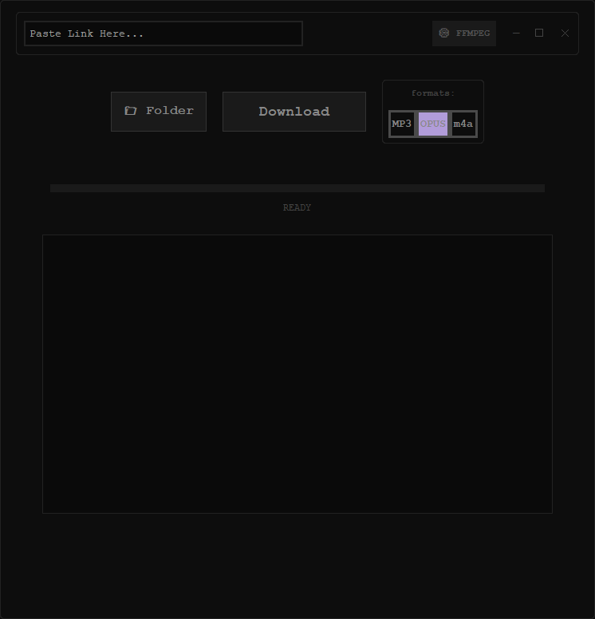

# YT-DLP Audio Interface (OPUS/MP3)

A minimalist, high-performance desktop GUI for yt-dlp designed for high-quality audio extraction. Featuring a dark-mode integrated control panel and built-in metadata tagging.

### Features
* **Integrated Header:** Window controls and URL input combined for a sleek, compact look.
* **Dynamic Pathing:** Select your download folder and FFMPEG location directly in the app.
* **Persistent Settings:** Remembers your paths between sessions via config.json.
* **High Quality:** Supports OPUS, MP3, and M4A with metadata auto-tagging.
* **Terminal Output:** Real-time logging of the download process.

### Installation and Setup
1. Download the latest .exe from the Releases page.
2. Ensure you have FFMPEG installed on your system.
3. Launch the app and click the FFMPEG button to point the app to your ffmpeg/bin folder.
4. Set your destination folder and start downloading.

### Built With
* CustomTkinter - Modern UI components.
* yt-dlp - The engine for media extraction.
* PyInstaller - For standalone executable packaging.

---

### THE APP WAS MADE WITH THE HELP OF AI, IT IS INTENDED FOR SELF USE